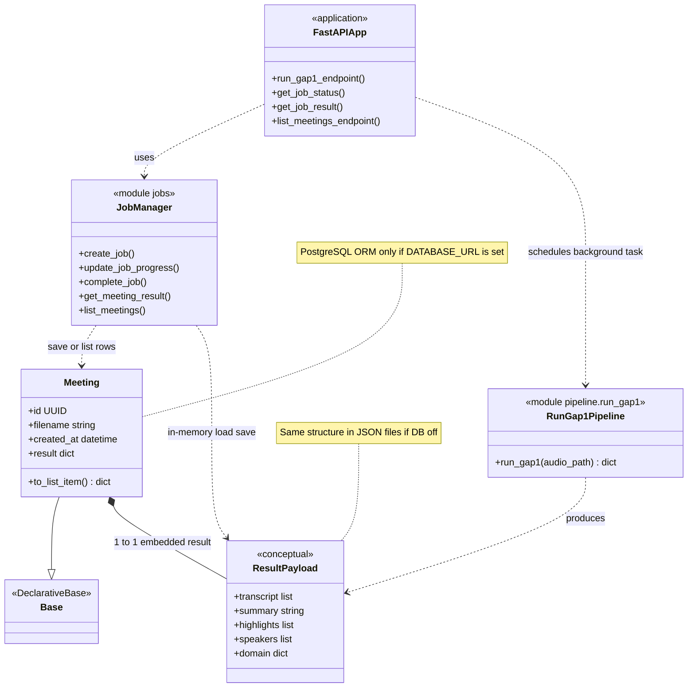

# PROSE-MEET — core class diagram (canonical)

This is the **smallest accurate** view: API layer, async job handling, analysis pipeline, and how results are stored. Python modules are shown as UML classes where that matches how you reason about the system.

## Notes (read when presenting)

1. **Background task** — The upload endpoint registers `process_gap1_job` (in `main.py`), which calls `run_gap1(...)` and then `complete_job(...)`. The diagram collapses that into “FastAPI … RunGap1Pipeline” plus “JobManager” for clarity.

2. **Two persistence modes** — If `DATABASE_URL` is set, `Meeting` rows are used. If not, meetings are stored as JSON files under `data/meetings/`; the **`Meeting` class and `Base` are not used at runtime** for that path, but the **same `ResultPayload`-shaped dict** is still what gets saved.

3. **`Base` is empty on purpose** — It is SQLAlchemy’s declarative root so `Meeting` registers with `Base.metadata` and `create_all()` can create the `meetings` table. It carries no business columns.

4. **`ResultPayload`** — Not a separate Python class; it is the **shape** of the `dict` returned by `run_gap1` and stored in `Meeting.result` / JSON files.
